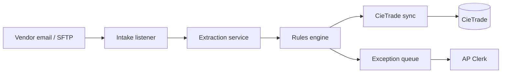
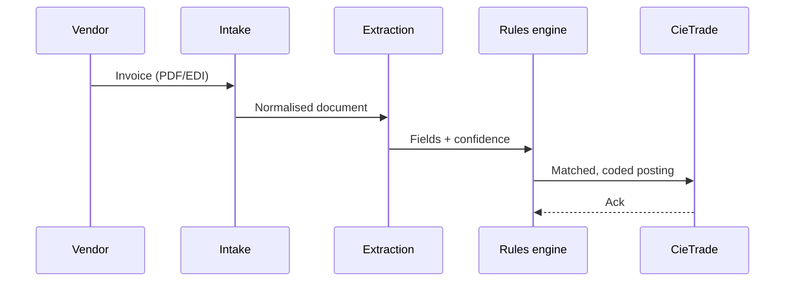
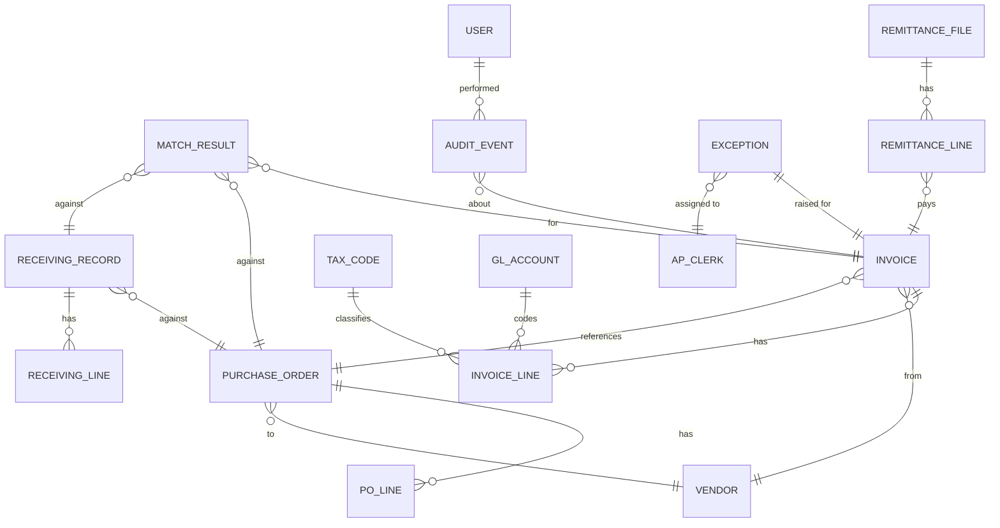

# Doc 3 · Technical Architecture & Solution Design — NorthStar Recycling AP/AR

## F3.1 · Solution overview & context diagram

A vendor-cloud pipeline sits between invoice intake (email/SFTP), the extraction
service, the rules engine, and CieTrade; staff interact only through CieTrade's
existing screens (ENG-01). Figure 1 shows the system in context. The component
architecture (F3.2) and the data model (F3.5) are detailed below, and the rules
engine is decomposed in F3.P.



## F3.2 · Component architecture

A representative invoice flows end-to-end in under five minutes (ENG-02). The
sequence below walks one document from intake to posting.



## F3.5 · Data architecture & dictionary

The domain entity-relationship model (Figure 3) spans more than fifteen entities,
so the in-doc render is flagged for a "view larger" link.



## F3.7 · Non-functional requirements

The pipeline's measurable targets are set out below; the headline availability bar is
called out for emphasis.

```card
value: 99.5%
label: PIPELINE AVAILABILITY
note: Measured monthly against the production SLA.
```

| Category | Metric | Target | Measurement |
|---|---|---|---|
| Performance | Intake-to-queue latency (p95) | ≤ 5 min | APM trace |
| Availability | Monthly uptime | 99.5% | SLA report |
| Throughput | Invoices per month | 1,100 | Pipeline counter |
| Throughput | Daily burst | 120 | Pipeline counter |

## F3.P · Subsystem deep-dive — rules engine internals

The rules engine decomposes into matching, tax, and duplicate-detection stages.
Figure 4 is a dense D2 diagram; when it cannot be made legible in-page it ships as
an attached high-resolution SVG.

```d2
# caption: Rules engine internals
intake -> normalize
normalize -> classify
classify -> match: 3-way
match -> tolerance: "±2% / CAD 25"
tolerance -> tiebreak
tiebreak -> tax_split
tax_split -> dup_check
dup_check -> post: clean
dup_check -> queue: exception
match -> queue: no PO
classify -> queue: low confidence
post -> cietrade
queue -> clerk
```
